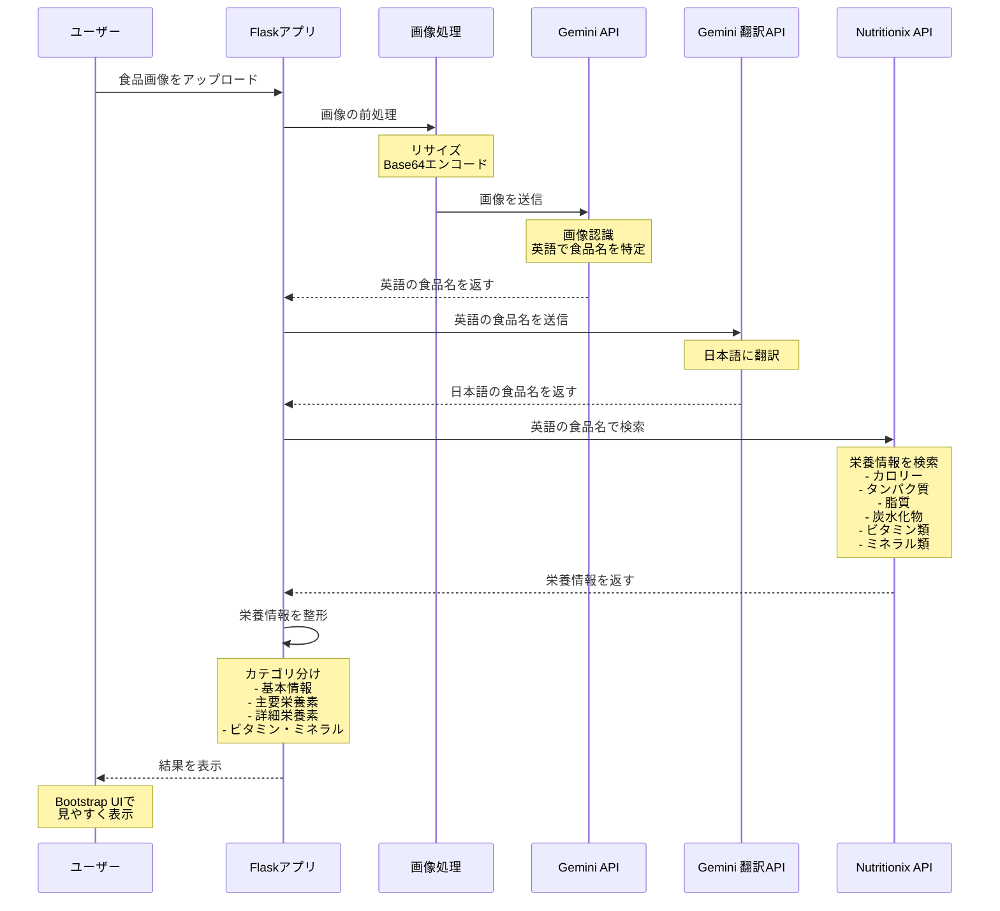

# 食品栄養アプリ処理フロー

## 処理の詳細説明

1. **画像アップロード & 前処理**
   - ユーザーが食品の画像をアップロード
   - 画像を適切なサイズにリサイズ
   - Base64エンコードしてAPI送信用に変換

2. **食品認識（Gemini API）**
   - 画像から食品を認識
   - 英語で食品名を返す（Nutritionix API用）
   - プロンプト: "Look at this food image and tell me what it is in English"

3. **翻訳処理（Gemini API）**
   - 英語の食品名を日本語に翻訳
   - ユーザー表示用の日本語名を生成

4. **栄養情報取得（Nutritionix API）**
   - 英語の食品名で栄養データベースを検索
   - 詳細な栄養情報を取得

5. **データ整形 & 表示**
   - 栄養情報を4つのカテゴリに分類
   - Bootstrap UIで見やすく表示
   - 適切な単位を付加（g, kcal, mg, %）
